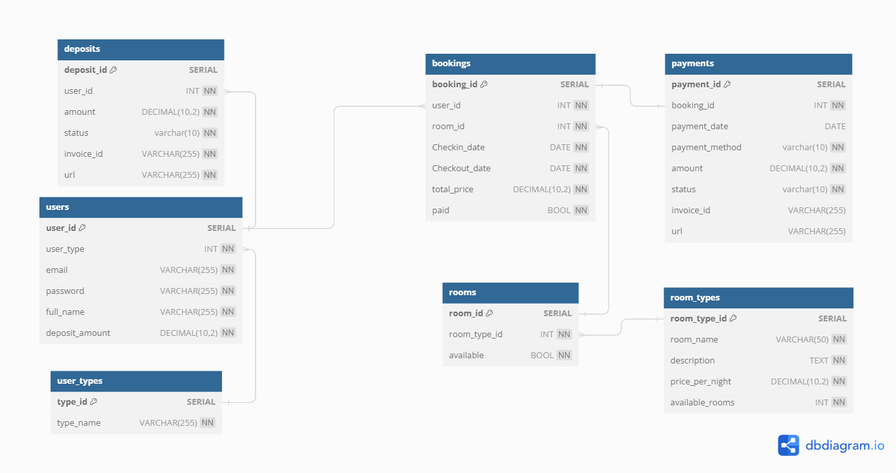
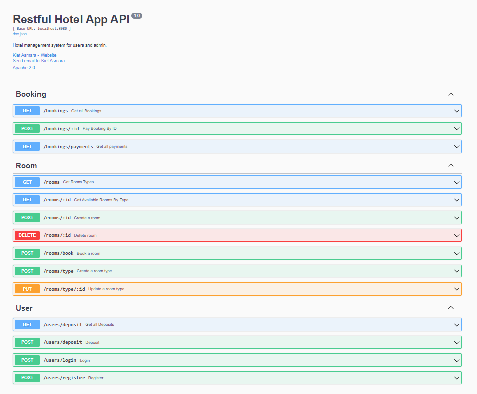

# Hotel 626
A hotel API mini-project made in ~24 hours.

Made with Golang, PostgreSQL, GORM, and Echo.

## Features
This project served as a place for me to learn how to implement these features:
- A **Payment Gateway** (Xendit) for deposits and payments
- A custom **error handling** system
- How to apply a basic **service pattern** to the app (https://www.alexedwards.net/blog/the-fat-service-pattern)
- Email notifications for payments (gomail)

App features:
- Deposit to balance
- Room booking
- Booking payments
- Room CRUD

## ERD

## API Docs

